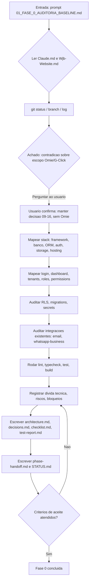
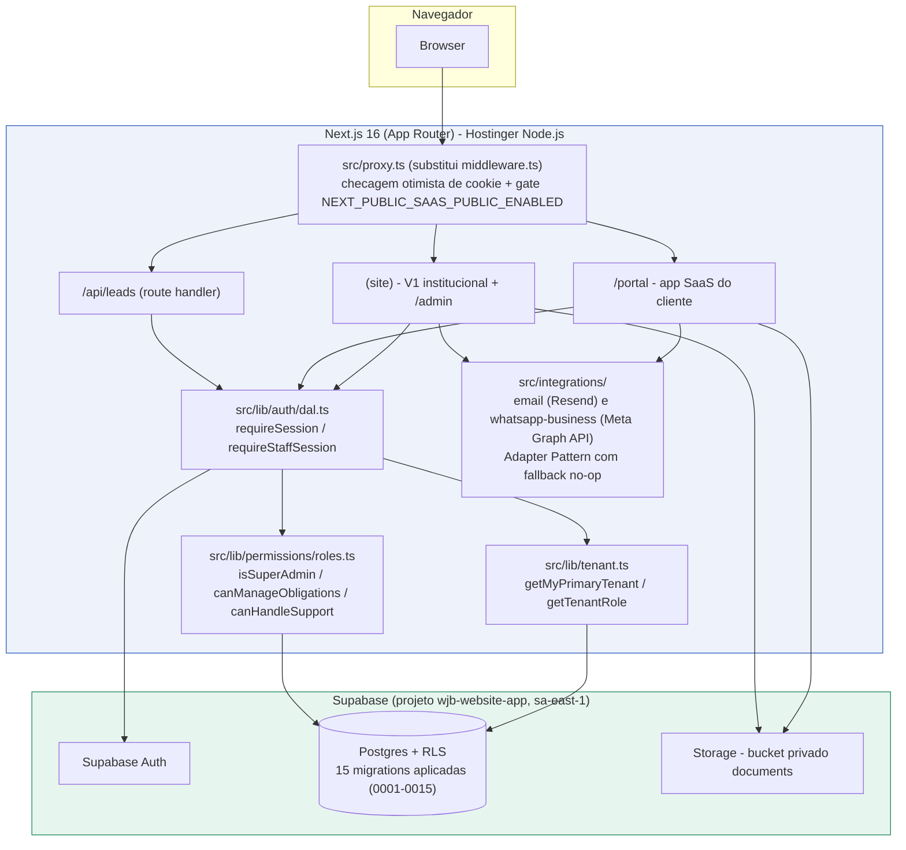

# Workflow da Fase 0

## Processo desta fase

## Arquitetura atual (Current State Architecture)

Notas sobre o diagrama:

- `NEXT_PUBLIC_SAAS_PUBLIC_ENABLED` está `false` hoje - `/login`, `/portal/*`, `/admin/*` e `/auth/*` respondem 404 de marca em produção. O código existe e funciona; só não está acessível ao público.
- As credenciais reais do Supabase (URL, anon key, service role) e do Resend/Meta WhatsApp **não estão configuradas** nem no ambiente local desta auditoria nem no servidor de produção (`hbuilds/config/.env` na Hostinger só tem `NEXT_PUBLIC_SITE_URL`) - ver `decisions.md` e `architecture.md`.
- Nenhum adapter de ERP/fiscal (Omie.G-Click ou outro) existe - decisão de produto, não lacuna técnica.
