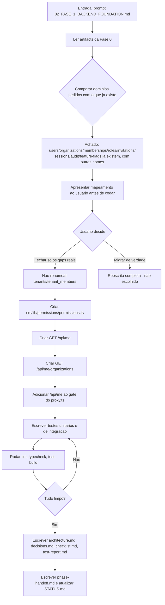
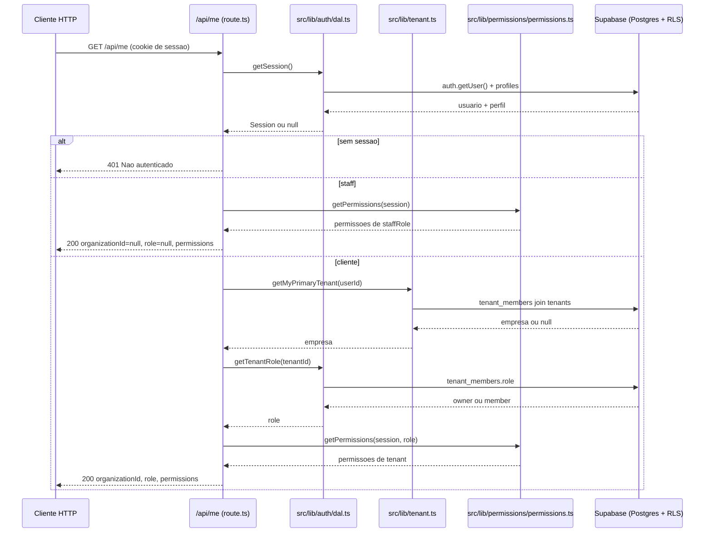

# Workflow da Fase 1

## Processo desta fase

## Fluxo de dados - GET /api/me

## Dependências

- `src/lib/auth/dal.ts` (`getSession`, `getTenantRole`) - já existente, não alterado.
- `src/lib/tenant.ts` (`getMyPrimaryTenant`) - já existente, não alterado.
- `src/types/database.ts` (`StaffRole`, `TenantMemberRole`) - já existente, não alterado.
- Nenhuma dependência nova instalada (nenhum pacote npm adicionado).

## Testes

- `src/tests/unit/permissions.test.ts` - 7 testes cobrindo `getPermissions`/`hasPermission` para staff (3 papéis) e cliente (owner/member), incluindo os casos sem `staffRole`/`tenantRole`.
- `src/tests/integration/me-api.test.ts` - 4 testes cobrindo `GET /api/me` (401 sem sessão, staff, cliente com empresa, cliente sem empresa).
- `src/tests/integration/me-organizations-api.test.ts` - 3 testes cobrindo `GET /api/me/organizations` (401, staff recebe lista vazia, cliente recebe empresas vinculadas).

## Saídas

- 2 rotas novas (`/api/me`, `/api/me/organizations`), 1 módulo novo de permissões, 1 linha adicionada ao gate do `proxy.ts`, 16 testes novos.

## Critério para avançar

Todos os itens do checklist marcados, lint/typecheck/test/build limpos (ver `test-report.md`) - fase concluída.
