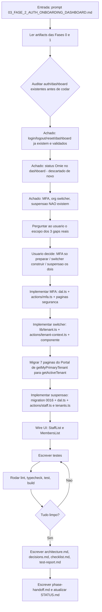
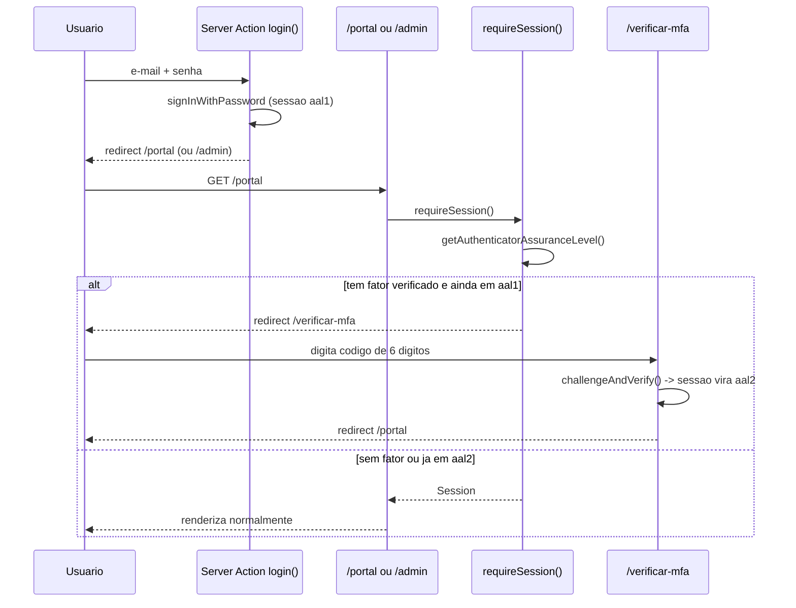
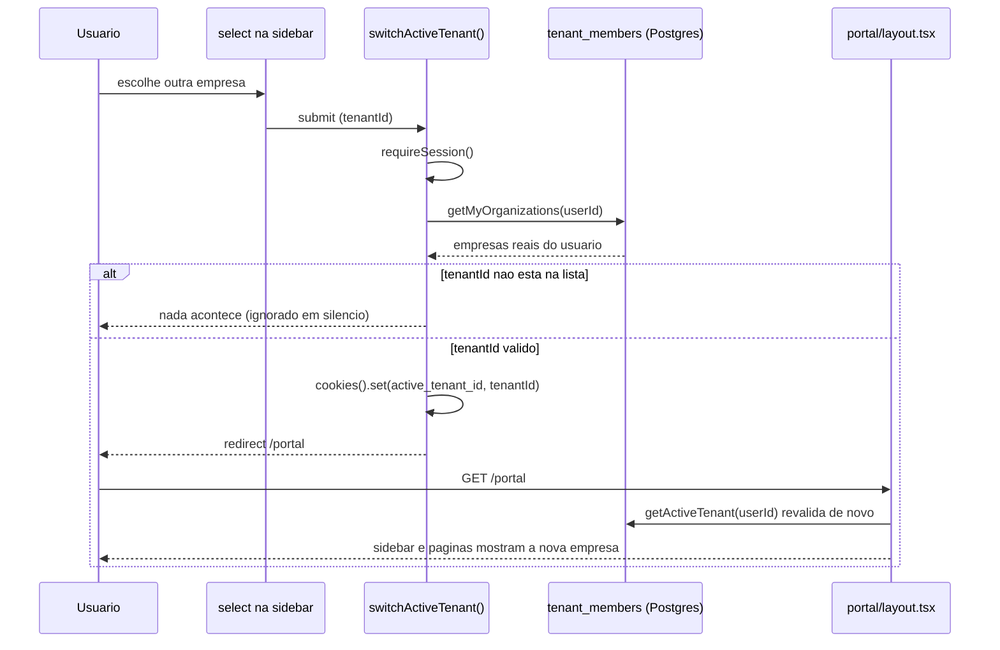
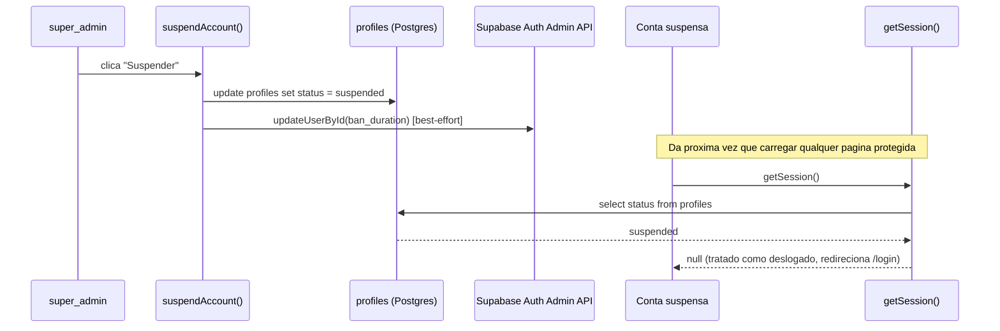

# Workflow da Fase 2

## Processo desta fase

## Fluxo de dados - MFA (login com step-up)

## Fluxo de dados - Organization switcher

## Fluxo de dados - Suspensão

## Dependências

- `@supabase/auth-js` (já era dependência transitiva de `@supabase/supabase-js`) - API `mfa.*` e `admin.updateUserById` já existiam, só passaram a ser usadas. Nenhuma dependência nova instalada.
- Tipos verificados direto em `node_modules/@supabase/auth-js/dist/module/lib/types.d.ts` e `GoTrueAdminApi.d.ts` antes de escrever código MFA/suspensão - não foram assumidos de memória.

## Testes

- `src/tests/integration/mfa-actions.test.ts` - 11 testes.
- `src/tests/integration/tenant-context.test.ts` - 7 testes.
- `src/tests/integration/account-status-actions.test.ts` - 6 testes.
- `src/tests/integration/me-api.test.ts` e `me-organizations-api.test.ts` - atualizados pra `getActiveTenant`/`getMyOrganizations`.

**Limitação de teste conhecida**: o bloqueio de sessão suspensa dentro de `getSession()`/`getTenantRole()` (ambos memoizados com `cache()` do React) não tem teste automatizado direto - `cache()` memoiza por argumento pra sempre dentro do mesmo módulo, o que quebra a reescrita de mock entre casos de teste no mesmo arquivo. Coberto por revisão manual do código + é a mesma lógica simples já usada pra `is_wjb_staff`. Recomendado como item de teste E2E manual quando as credenciais do Supabase forem reconectadas (ver Fase 0).

## Saídas

- 1 migration nova (`0016_account_status.sql`).
- 5 Server Actions novas de MFA, 1 de troca de empresa, 4 de suspensão/reativação.
- 3 páginas novas (`/verificar-mfa`, `/portal/seguranca`, `/admin/seguranca`).
- 7 páginas do Portal migradas pra `getActiveTenant()`.
- 24 testes novos/atualizados.

## Critério para avançar

Lint/typecheck/test/build limpos (ver `test-report.md`), checklist completo - fase concluída.
