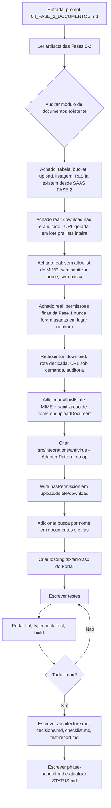
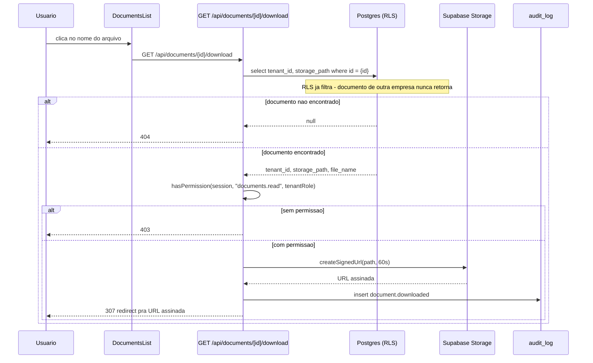
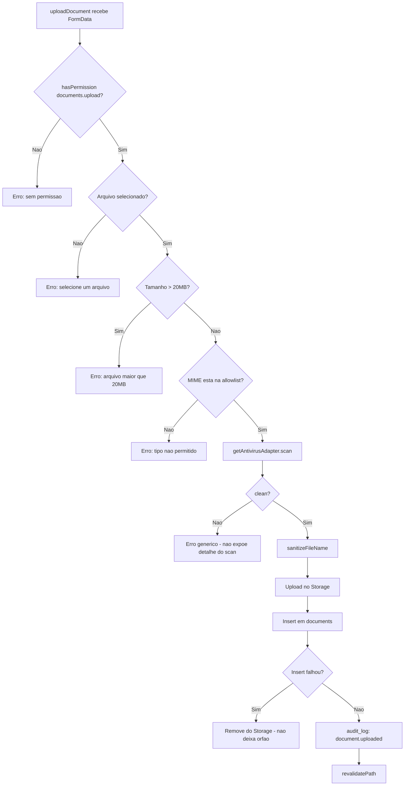

# Workflow da Fase 3

## Processo desta fase

## Fluxo de dados - Download auditado

## Fluxo de dados - Upload endurecido

## Dependências

- `src/lib/permissions/permissions.ts` (Fase 1) - `documents.delete` adicionado ao `Permission` union e a `STAFF_PERMISSIONS`.
- `src/integrations/antivirus/` - novo, mesmo padrão de `email`/`whatsapp-business`.
- Nenhuma dependência npm nova.

## Testes

- `src/tests/unit/documents.test.ts` - 8 testes (`isAllowedMimeType`, `sanitizeFileName`).
- `src/tests/integration/documents-download-api.test.ts` - 4 testes (401, 404 por RLS, sucesso com auditoria, staff sem checagem de tenant).
- `src/tests/integration/documents-upload-action.test.ts` - 7 testes (permissão, tamanho, MIME, antimalware, sanitização, sucesso, rollback de órfão).

## Saídas

- 1 rota nova (`GET /api/documents/[id]/download`).
- 1 integração nova (`src/integrations/antivirus`).
- `src/lib/documents.ts` reescrito (sem geração de URL em lote; busca; allowlist; sanitização).
- `src/actions/documents.ts` endurecido (permissões, MIME, antimalware, nome sanitizado).
- 4 arquivos novos de `loading.tsx`/`error.tsx`.
- 19 testes novos.

## Critério para avançar

Lint/typecheck/test/build limpos (ver `test-report.md`), checklist completo - fase concluída.
