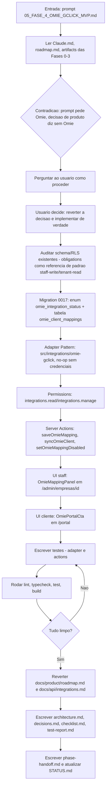
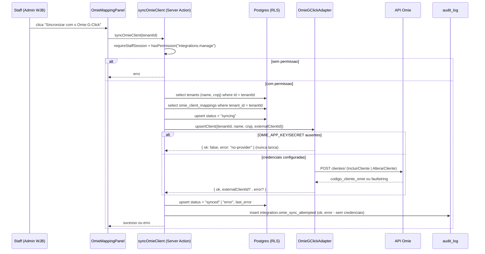
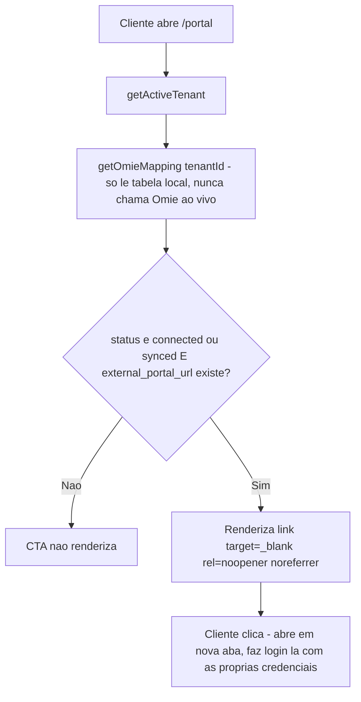

# Workflow da Fase 4

## Processo desta fase

## Fluxo de dados - Sincronização de cliente (staff aciona)

## Fluxo de dados - CTA "Ver no Portal Contábil" (cliente)

## Dependências

- `src/lib/permissions/permissions.ts` (Fase 1) - `integrations.read`/`integrations.manage` novos.
- `src/lib/auth/dal.ts` (`requireStaffSession`) e `src/lib/tenant.ts` (`getActiveTenant`) - reaproveitados sem alteração.
- Nenhuma dependência npm nova (`fetch` nativo, mesmo padrão do adapter Meta WhatsApp).

## Testes

- `src/tests/unit/omie-gclick-adapter.test.ts` - 5 testes (Incluir vs. Alterar, faultstring tratado como erro sem lançar, falha de rede nunca lança, fallback no-op nunca chama a rede).
- `src/tests/integration/omie-gclick-actions.test.ts` - 11 testes (permissão em `saveOmieMapping`/`syncOmieClient`/`setOmieMappingDisabled`, validação de URL https, transições de status, auditoria, empresa inexistente).
- `src/tests/unit/permissions.test.ts` - 1 teste novo (`integrations.read` no cliente, nunca `integrations.manage`).

## Saídas

- 1 migration nova (`0017_omie_gclick_integration.sql`) + tipos em `src/types/database.ts`.
- 1 integração nova (`src/integrations/omie-gclick/`).
- 1 arquivo de Server Actions novo (`src/actions/omie-gclick.ts`).
- 1 helper de leitura novo (`src/lib/omie-gclick.ts`) + validação (`src/lib/validation/omie-gclick.ts`).
- 3 componentes novos (`OmieStatusBadge`, `OmieMappingPanel`, `OmiePortalCta`).
- `docs/product/roadmap.md` e `docs/api/integrations.md` atualizados (decisão revertida, documentado).
- 17 testes novos.

## Critério para avançar

Lint/typecheck/test/build limpos (ver `test-report.md`), checklist completo - fase concluída.
