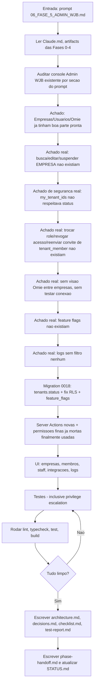
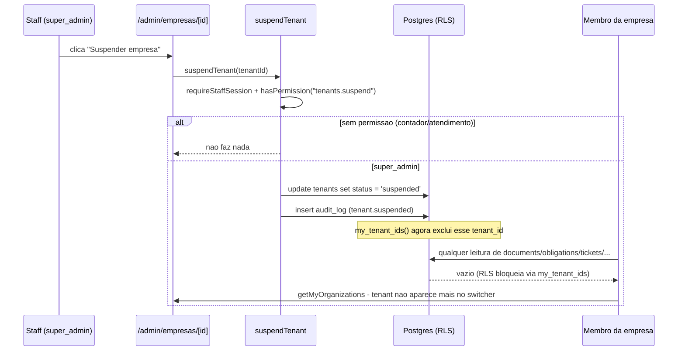
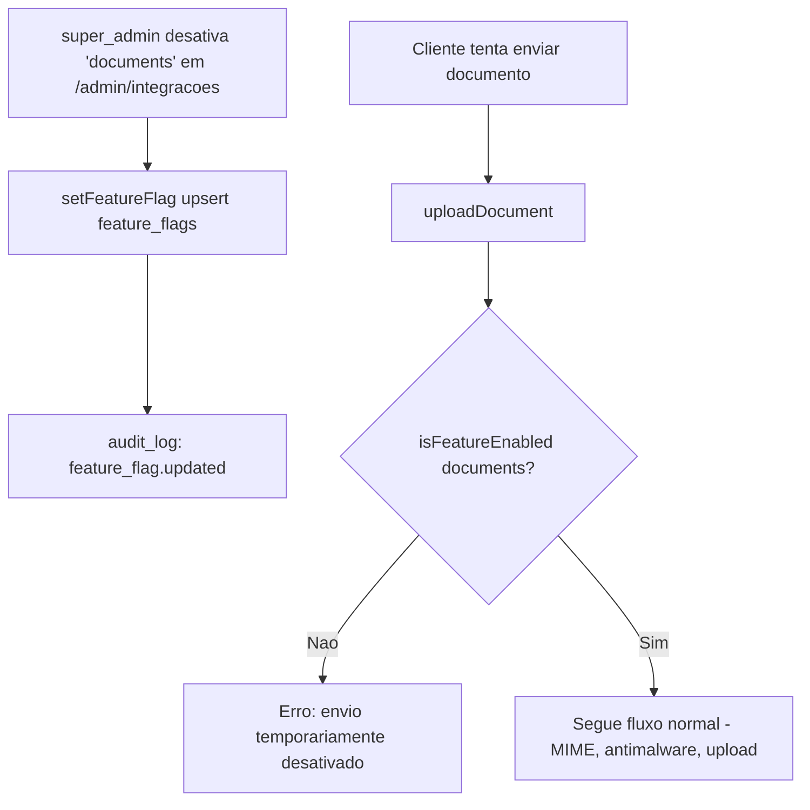

# Workflow da Fase 5

## Processo desta fase

## Fluxo de dados - Suspender empresa (corta acesso de todos os membros)

## Fluxo de dados - Feature flag desativa uma feature globalmente

## Dependências

- `my_tenant_ids()`/`is_tenant_owner()` (0003) - redefinidas (mesma assinatura) na migration 0018.
- `src/lib/permissions/permissions.ts` (Fase 1) - `organizations.manage`/`members.manage`/`integrations.manage` finalmente usadas; `feature_flags.manage`/`tenants.suspend` novas.
- Nenhuma dependência npm nova.

## Testes

- `src/tests/integration/admin-console-actions.test.ts` (novo) - 14 testes (updateTenant, suspendTenant/reactivateTenant com privilege escalation, updateMemberRole, revokeMemberAccess, resendMemberInvite, resendStaffInvite com privilege escalation, setFeatureFlag com privilege escalation).
- `src/tests/unit/feature-flags.test.ts` (novo) - 3 testes (fallback seguro, lista completa mesmo com banco incompleto).
- `src/tests/unit/audit-log.test.ts` (novo) - 8 testes (cada filtro isoladamente, busca por usuário sem resultado, mapeamento de linha, `listTenantOptions`).
- `src/tests/integration/omie-gclick-actions.test.ts` - 4 novos (`testOmieConnection`: sem permissão/sucesso/falha; gate de feature flag em `syncOmieClient`).
- `src/tests/integration/documents-upload-action.test.ts` - 1 novo (gate de feature flag em `uploadDocument`).
- `src/tests/unit/permissions.test.ts` - 1 novo (`feature_flags.manage`/`tenants.suspend` só super_admin).

## Saídas

- 1 migration nova (`0018_admin_console.sql`) + tipos em `src/types/database.ts`.
- 2 métodos novos no adapter/actions Omie (`testConnection`/`testOmieConnection`).
- 1 módulo novo (`src/lib/feature-flags.ts`) + 1 arquivo de Server Action (`src/actions/feature-flags.ts`).
- 6 Server Actions novas em `src/actions/tenants.ts` + 1 em `src/actions/staff.ts`.
- 1 página nova (`/admin/integracoes`) + filtros em `/admin/logs` + busca/edição/suspensão em `/admin/empresas`.
- 31 testes novos.

## Critério para avançar

Lint/typecheck/test/build limpos (ver `test-report.md`), checklist completo - fase concluída.
