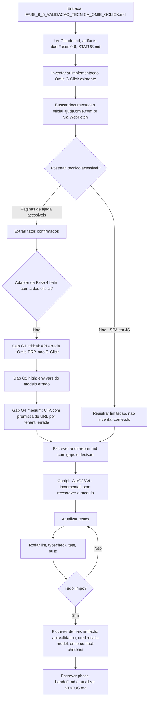
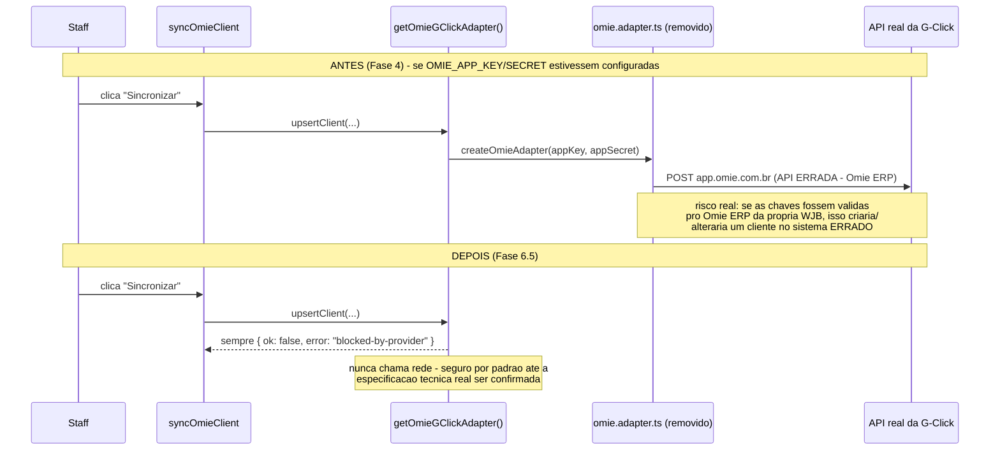

# Workflow da Fase 6.5

## Processo desta fase

## Fluxo de dados - Antes x depois da correção

## Dependências

- `src/lib/permissions/permissions.ts` (Fase 1), `src/lib/feature-flags.ts` (Fase 5) - reaproveitados sem alteração.
- `my_tenant_ids()` (corrigida na Fase 5) - base da validação de isolamento nesta auditoria.
- Nenhuma dependência npm nova. `WebFetch`/`WebSearch` usados só para pesquisa (não fazem parte do código do produto).

## Testes

- `src/tests/unit/omie-gclick-provider.test.ts` (novo) - 3 testes: `isOmieConfigured()` sempre falso, `upsertClient`/`testConnection` nunca chamam `fetch`, sempre resolvem com `blocked-by-provider`.
- `src/tests/unit/omie-gclick-adapter.test.ts` (removido) - testava a implementação incorreta, não fazia mais sentido manter.
- `src/tests/integration/omie-gclick-actions.test.ts` - sem alteração necessária (mocka `@/integrations/omie-gclick` no nível de interface, não conhece a implementação interna).

## Saídas

- 1 arquivo removido (`omie.adapter.ts`), 1 arquivo novo (`constants.ts`).
- `provider.ts`/`types.ts` reescritos para refletir o estado `BLOCKED_BY_PROVIDER` honestamente.
- `OmiePortalCta` corrigido (URL real como fallback).
- Copy de 2 componentes + 1 página corrigida.
- `docs/api/integrations.md` e artifacts das Fases 4/5 atualizados com adendos (sem reescrever histórico).
- 8 artifacts novos desta fase + `STATUS.md` atualizado.
- 3 testes novos, 5 removidos (líquido: -2, pela remoção do arquivo que testava a implementação errada).

## Critério para avançar

Lint/typecheck/test/build limpos (ver `test-report.md`), checklist completo, decisão documentada (`BLOCKED_BY_PROVIDER`) - fase concluída. Fase 7 (gate explícito do prompt) só deveria iniciar com `VALIDATED` ou `BLOCKED_BY_CREDENTIALS` - ver `phase-handoff.md` para a leitura literal desse critério aplicada ao resultado desta fase.
