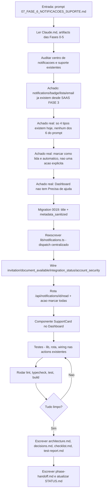
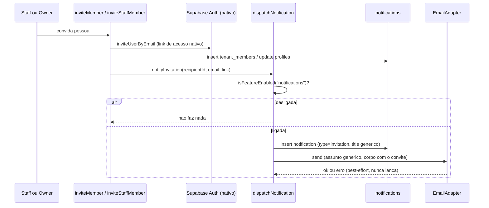
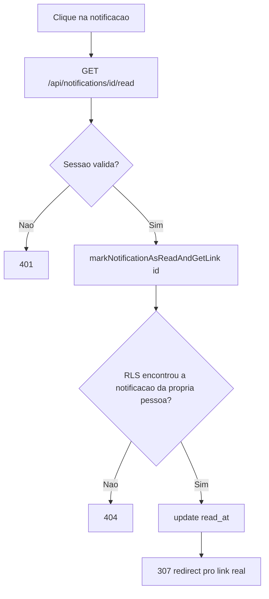

# Workflow da Fase 6

## Processo desta fase

## Fluxo de dados - Convite dispara notificação

## Fluxo de dados - Marcar como lida (individual) via redirect auditado

## Dependências

- `src/lib/feature-flags.ts` (Fase 5) - kill switch `notifications`, único ponto de checagem em `dispatchNotification`.
- `src/integrations/email` (Fase 5 de integrações) - reaproveitado sem alteração.
- `src/integrations/whatsapp` (V1) - `getWhatsAppLink()` reaproveitado no `SupportCard`.
- Nenhuma dependência npm nova.

## Testes

- `src/tests/unit/notifications.test.ts` (novo) - 18 testes: todas as funções públicas de `lib/notifications.ts` (dispatch, resolução de destinatários, kill switch, assunto genérico, listagem, contagem, marcar lida individual/todas).
- `src/tests/integration/notifications-read-api.test.ts` (novo) - 3 testes (401, 404, 307 com marcação).
- `src/tests/integration/invite-notifications.test.ts` (novo) - 2 testes (convite de membro e de staff disparam `notifyInvitation`).
- `src/tests/integration/documents-upload-action.test.ts`, `account-status-actions.test.ts`, `omie-gclick-actions.test.ts` - atualizados (mock de `@/lib/notifications`) + 3 novas asserções cobrindo o disparo real de cada evento.

## Saídas

- 1 migration nova (`0019_notification_enhancements.sql`) + tipos em `src/types/database.ts`.
- `src/lib/notifications.ts` reescrito (6 tipos, 4 funções públicas novas).
- 1 rota nova (`GET /api/notifications/[id]/read`) + 1 Server Action nova (`src/actions/notifications.ts`).
- 1 componente novo (`SupportCard`) + `NotificationsList` reescrito.
- 4 Server Actions existentes (`inviteMember`, `inviteStaffMember`, `uploadDocument`, `suspendAccount`/`reactivateAccount`, `suspendMember`/`reactivateMember`, `syncOmieClient`) ganharam disparo de notificação.
- 23 testes novos.

## Critério para avançar

Lint/typecheck/test/build limpos (ver `test-report.md`), checklist completo - fase concluída.
